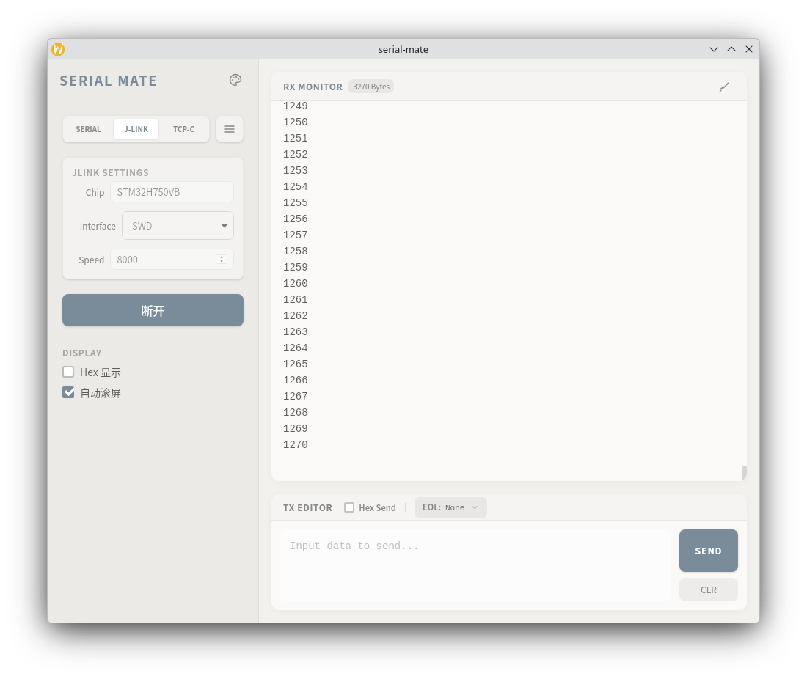

# Serial Mate - 现代化串口调试助手

   

**Serial Mate** 是一款基于 **Go (Wails)** 和 **Vue 3** 构建的跨平台串口调试工具。它摒弃了传统工控软件陈旧的界面，采用了现代化的扁平设计与 **莫兰迪 (Morandi)** 配色风格，致力于为嵌入式开发者提供既美观又高效的调试体验。

## ✨ 主要功能 (Features)

### 🎨 极致 UI/UX 体验
* **莫兰迪设计风格**: 默认采用低饱和度的莫兰迪配色。
* **动态主题引擎**:
    * 内置 5 款精选预设（雾霾蓝、豆沙绿、干燥玫瑰、极致灰、烟熏紫）。
    * **RGB 自由调色**: 支持通过 RGB 滑动条实时自定义主色调，界面背景、按钮、滚动条及高亮元素会自动根据主色计算并适配。
    * 无延迟响应：基于 CSS 变量与 RGB 直通技术，调色极其丝滑，无闪烁。
* **现代化交互**:
    * 卡片式布局 (Rx Monitor / Tx Editor)。
    * 毛玻璃 (Backdrop Blur) 视觉效果。
    * 灵动的微交互动画（如清空数据的“扫把”摆动动画）。

### 🛠 全能连接支持
* **串口 (Serial Port)**:
    * **波特率**: 支持标准波特率选择，也支持**手动输入任意波特率**。
    * **数据位**: 5, 6, 7, 8。
    * **校验位**: None, Odd, Even, Mark, Space。
    * **停止位**: 1, 1.5, 2。
* **网络调试 (Network)**:
  * **TCP Client**: 作为客户端连接远程服务器。
  * **TCP Server**: 本地开启服务监听连接。
  * **UDP**: 支持点对点 UDP 通信。
* **J-Link RTT (Real Time Transfer)**: 

### 📡 数据收发监控
* **接收 (RX)**:
    * **Hex / ASCII 切换**: 支持一键切换十六进制与文本显示。
    * **智能解码**: 内置 Base64 解码与 UTF-8 文本解码，完美解决中文乱码与特殊字符显示问题。
    * **自动滚屏**: 数据更新时自动锁定到底部，可随时暂停查看历史数据。
    * **字节统计**: 实时统计接收到的字节总数。
* **发送 (TX)**:
    * 支持文本发送与 Hex (十六进制) 发送。
    * 快捷清空发送区。

## 🛠 技术栈 (Tech Stack)

* **后端 (Backend)**: Go (Golang)
    * 框架: [Wails v2](https://wails.io/)
    * 串口库: `go.bug.st/serial`
* **前端 (Frontend)**: TypeScript
    * 框架: Vue 3 (Composition API)
    * 构建工具: Vite 6
    * 样式库: **Tailwind CSS v4** 
